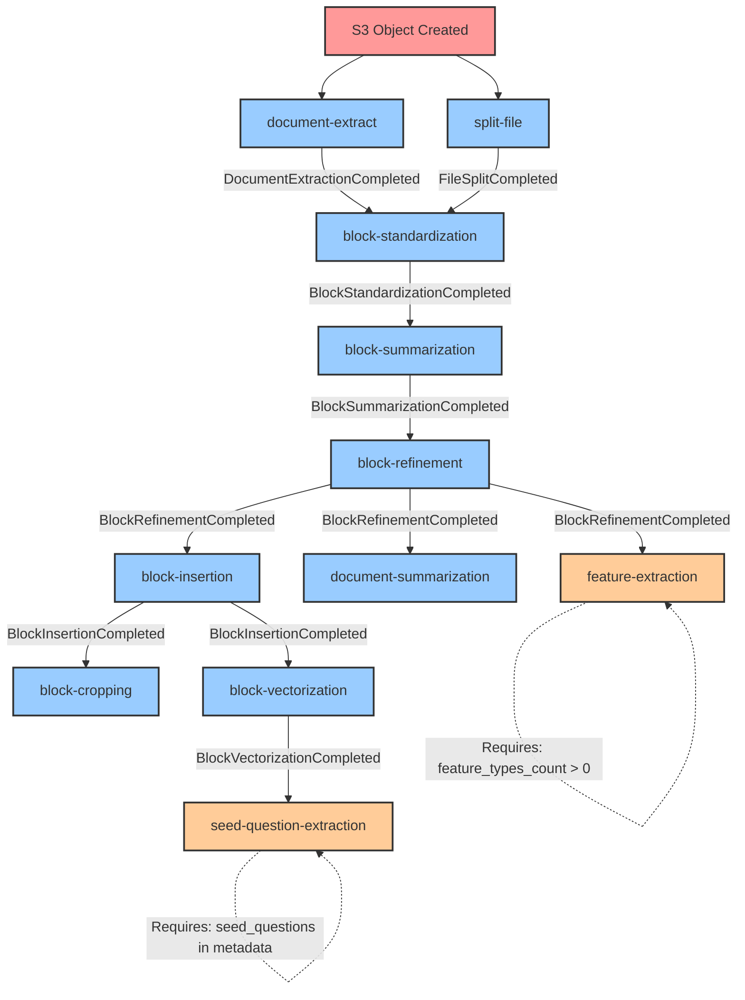

# Stitch Worker

A serverless event-driven document processing pipeline built with AWS CDK. This project creates a comprehensive system of Lambda functions, SQS queues, and EventBridge rules that process documents through various stages including extraction, block processing, summarization, question generation, and feature extraction.

## Architecture

The system consists of two main stacks:

### StitchWorkerStack
The main processing stack that handles document processing workflows:

1. **EventBridge Bus**: Central event bus for all document processing events (`{prefix}-{suffix}-datastores-bus`)
2. **SQS Queues**: Message queues for each processing stage
3. **Lambda Functions**: Serverless functions that process documents at each stage
4. **EventBridge Rules**: Rules that route events between processing stages
5. **S3 Bucket**: Document storage (for local environment)
6. **EC2 Instance**: Hub instance for processing (optional, configurable)
7. **SNS Topics**: For document extraction notifications
8. **CloudWatch Logs**: Centralized logging for all events

### StitchOrchestrationStack
A lightweight orchestration stack:

1. **EventBridge Bus**: Dedicated bus for orchestration events (`{prefix}-{suffix}-orchestrations`)
2. **SQS Queue**: Queue for orchestration events (`{prefix}-{suffix}-start-orchestration`)
3. **EventBridge Rule**: Rule to handle orchestration events

## Processing Pipeline

The document processing pipeline consists of the following stages:

### Pipeline Flow Diagram



### Event Flow Details

| Process | Event Source | Event Type | Conditions |
|---------|-------------|------------|------------|
| `document-extract` | S3 | Object Created | - |
| `split-file` | S3 | Object Created | - |
| `block-standardization` | stitch.worker | DocumentExtractionCompleted | - |
| `block-summarization` | stitch.worker | BlockStandardizationCompleted | - |
| `block-refinement` | stitch.worker | BlockSummarizationCompleted | - |
| `block-insertion` | stitch.worker | BlockRefinementCompleted | - |
| `block-cropping` | stitch.worker | BlockInsertionCompleted | - |
| `block-vectorization` | stitch.worker | BlockInsertionCompleted | - |
| `document-summarization` | stitch.worker | BlockRefinementCompleted | - |
| `seed-question-extraction` | stitch.worker | BlockVectorizationCompleted | `seed_questions` in metadata |
| `feature-extraction` | stitch.worker | BlockRefinementCompleted | `feature_types_count > 0` |

### 1. Document Extraction (`document-extract`)
- **Trigger**: S3 Object Created event
- **Function**: Extracts text from uploaded documents using AWS Textract
- **Output**: Emits "DocumentExtractionCompleted" event
- **Configuration**: Uses SNS for Textract notifications

### 2. Block Standardization (`block-standardization`)
- **Trigger**: DocumentExtractionCompleted event
- **Function**: Standardizes and processes document blocks
- **Output**: Emits "BlockStandardizationCompleted" event

### 3. Block Summarization (`block-summarization`)
- **Trigger**: BlockStandardizationCompleted event
- **Function**: Generates summaries for document blocks using OpenAI
- **Output**: Emits "BlockSummarizationCompleted" event
- **Memory**: 512MB, Timeout: 10 minutes

### 4. Block Refinement (`block-refinement`)
- **Trigger**: BlockSummarizationCompleted event
- **Function**: Refines blocks and generates embeddings using OpenAI and Pinecone
- **Output**: Emits "BlockRefinementCompleted" event
- **Memory**: 256MB, Timeout: 10 minutes

### 5. Block Insertion (`block-insertion`)
- **Trigger**: BlockRefinementCompleted event
- **Function**: Inserts processed blocks into database
- **Output**: Emits "BlockInsertionCompleted" event

### 6. Block Cropping (`block-cropping`)
- **Trigger**: BlockInsertionCompleted event
- **Function**: Crops and processes block images
- **Output**: Emits "BlockCroppingCompleted" event
- **Memory**: 512MB

### 7. Block Vectorization (`block-vectorization`)
- **Trigger**: BlockInsertionCompleted event
- **Function**: Generates vector embeddings for blocks
- **Output**: Emits "BlockVectorizationCompleted" event

### 8. Document Summarization (`document-summarization`)
- **Trigger**: BlockRefinementCompleted event
- **Function**: Generates overall document summary
- **Output**: Emits "DocumentSummarizationCompleted" event
- **Memory**: 512MB

### 9. Seed Question Extraction (`seed-question-extraction`)
- **Trigger**: BlockVectorizationCompleted event (conditional)
- **Condition**: Requires `seed_questions` in metadata
- **Function**: Generates questions from document content
- **Output**: Emits "SeedQuestionsGenerated" event

### 10. Feature Extraction (`feature-extraction`)
- **Trigger**: BlockRefinementCompleted event (conditional)
- **Condition**: Requires `feature_types_count > 0` in metadata
- **Function**: Extracts specified features from document
- **Output**: Emits "FeatureExtractionCompleted" event
- **Memory**: 512MB, Timeout: 10 minutes

### 11. Split File (`split-file`)
- **Trigger**: S3 Object Created event
- **Function**: Splits large files for processing
- **Memory**: 2GB

## Prerequisites

- Python 3.12 or later
- Node.js and npm
- AWS CDK CLI
- AWS CLI configured with appropriate credentials
- AWS account with sufficient permissions
- [uv](https://github.com/astral-sh/uv) - Fast Python package installer and resolver

## Setup

1. Install AWS CDK CLI:
```bash
npm install -g aws-cdk
```

2. Install Python dependencies using uv:
```bash
# Install uv if you haven't already
curl -LsSf https://astral.sh/uv/install.sh | sh

# Install dependencies
uv sync
```

3. Configure AWS credentials:
```bash
aws configure
```

## Configuration

The stack is configured through the `cdk.json` file and environment-specific settings:

### cdk.json Configuration
```json
{
  "context": {
    "environments": {
      "dev": {
        "account": "613563724766",
        "region": "us-east-2"
      },
      "local": {
        "account": "000000000000",
        "region": "us-east-1"
      }
    },
    "naming": {
      "prefix": "stitch",
      "suffix": "dev"
    },
    "tags": {
      "Owner": "Jason DeCorte",
      "Project": "stitch-worker"
    }
  }
}
```

### Environment Variables
The system uses various environment variables for configuration:

- **OpenAI**: API keys, model names, temperature settings
- **Pinecone**: API keys, index names
- **Database**: Host, port, credentials
- **AWS Services**: S3 bucket names, SNS topic ARNs
- **Processing**: Batch sizes, timeouts, memory limits

## Deployment

1. Bootstrap CDK (first time only):
```bash
cdk bootstrap
```

2. Deploy the main stack:
```bash
cdk deploy StitchWorkerStack
```

3. Deploy the orchestration stack:
```bash
cdk deploy StitchOrchestrationStack
```

## Process Configuration

Processes are configured in `src/stitch_worker/processes.yaml` and include:

- **Event Patterns**: Define when each process is triggered
- **Lambda Configuration**: Memory, timeout, environment variables
- **IAM Policies**: Required permissions for each function
- **Conditional Execution**: Some processes only run based on metadata

## Lambda Functions

Each Lambda function:
- Runs on Python 3.12
- Uses AWS Lambda Powertools for logging and observability
- Has configurable memory and timeout settings
- Includes appropriate IAM permissions
- Emits events to EventBridge upon completion

## SQS Queues

Each queue:
- Has configurable visibility timeout
- Retains messages for 14 days
- Is named with the pattern: `{prefix}-{suffix}-{process-name}`

## EventBridge Integration

- **Centralized Event Bus**: All processing events flow through the main bus
- **Event Logging**: All events are automatically logged to CloudWatch
- **Event Patterns**: Sophisticated pattern matching for conditional processing
- **Cross-Stack Communication**: Events can trigger processes across different stacks

## Development

1. Make changes to the stack in `src/stitch_worker/stitch_worker_stack.py`
2. Update process configuration in `src/stitch_worker/processes.yaml`
3. Update Lambda function code in the appropriate handler modules
4. Test changes:
```bash
cdk synth  # Generate CloudFormation template
cdk diff   # Compare with deployed stack
cdk deploy # Deploy changes
```

### Managing Dependencies

This project uses `uv` for dependency management:

```bash
# Install dependencies
uv sync

# Add a new dependency
uv add <package>

# Add a development dependency
uv add --group dev <package>

# Update dependencies
uv sync
```

## Monitoring and Observability

- **CloudWatch Logs**: Centralized logging for all Lambda functions
- **EventBridge**: Event tracking and debugging
- **SQS Metrics**: Queue performance monitoring
- **Lambda Metrics**: Function performance and error tracking

## Cleanup

To remove all resources:
```bash
cdk destroy StitchWorkerStack
cdk destroy StitchOrchestrationStack
```

## License

This project is licensed under the GNU General Public License v3.0 (GPL-3.0). See the [LICENSE](LICENSE) file for details.

The GPL-3.0 license grants you the freedom to:
- Use the software for any purpose
- Change the software to suit your needs
- Share the software with your friends and neighbors
- Share the changes you make

When you distribute the software, you must:
- Include the source code
- Include the license
- State significant changes made to the software
- Include the same license with your modifications
